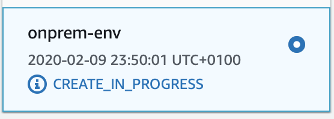
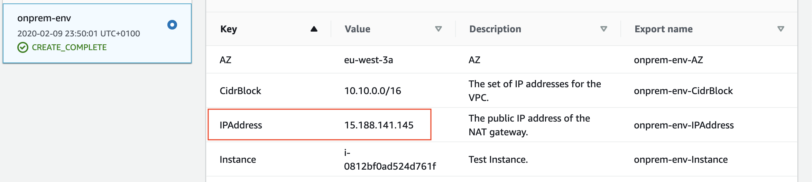
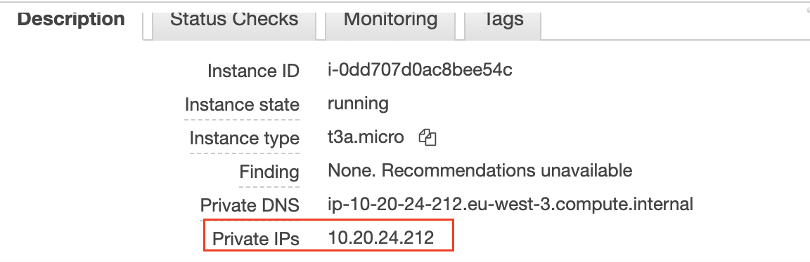

# Module 1: Environments Deployment

In this module, you will create 2 VPCs using a CloudFormation template. As a first step,download the [template](../templates/vpc-template.yaml) 

## 1. Create On Prem VPC emulation

Use the AWS console to launch the CloudFormation previsouly downloaded.

> The console's region will default to the last region you were using previously. 

<details>
<summary><strong>Step-by-step instructions (expand for details)</strong></summary><p>

1. In the AWS Management Console choose **Services** then select **CloudFormation** under Management & Governance.

2. Choose your desired **Region** in top-right of the console if not already selected.

3. Choose **Stacks**.

4. Choose **Create Stack** in the top right of the console and select **With new resources (standard)**.

5. In the 'Specify template' section, choose **Upload a template file** and click on **Choose file** and upload the [template](../templates/vpc-template.yaml).

6. Choose **Next**.

7. Input `onprem-env` as the 'Stack name'.

8. Input `onprem` as the 'Environment' parameter in the 'Parameters section'.

9. Input the name of your organization as the 'Organization Identifier' parameter in the 'Parameters section' or leave default value.

10. Input `10` as the ClassB in the 'Parameters section'. This will create 10.10.0.0/16 CIDR VPC. 

11. Choose **Next**.

12. Leave the default setting and choose **Next**.

13. Leave the default setting and check the case **I acknowledge that AWS CloudFormation might create IAM resources with custom names.**.

14. Choose **Create stack**.

	

15. On the stack creation completion go to the **Output** and take note of the 'IPAddress' parameter. This will be the public IP Address of our VPN Gateway.

	

</p></details>

## 2. Create AWS VPC

Use the AWS console to launch the same CloudFormation.

> The console's region will default to the last region you were using previously. This should match the region where you launched your On Prem environment previously.

<details>
<summary><strong>Step-by-step instructions (expand for details)</strong></summary><p>

1. In the AWS Management Console choose **Services** then select **CloudFormation** under Management & Governance.

2. Choose your desired **Region** in top-right of the console if not already selected. This should match the region where you launched your On Prem environment previously.

3. Choose **Stacks**.

4. Choose **Create Stack** in the top right of the console and select **With new resources (standard)**.

5. In the 'Specify template' section, choose **Upload a template file** and click on **Choose file** and upload the [template](../templates/vpc-template.yaml).

6. Choose **Next**.

7. Input `aws-env` as the 'Stack name'.

8. Input `aws` as the 'Environment' parameter in the 'Parameters section'.

9. Input the name of your organization as the 'Organization Identifier' parameter in the 'Parameters section' or leave default value.

10. Input `20` as the ClassB in the 'Parameters section'. This will create 10.20.0.0/16 CIDR VPC. This should be different from the On Prem CIDR avoiding overlapping

11. Choose **Next**.

12. Leave the default setting and choose **Next**.

13. Leave the default setting and check the case **I acknowledge that AWS CloudFormation might create IAM resources with custom names.**.

14. Choose **Create stack**.
    
</p></details>

## 2. Tests

Let's now do some tests and try to reach our AWS EC2 instance from our emulated On Prem EC2 instance. 

> The console's region will default to the last region you were using previously. This should match the region where you launched your On Prem environment previously.

<details>
<summary><strong>Step-by-step instructions (expand for details)</strong></summary><p>

1. In the AWS Management Console choose **Services** then select **System Manager** under Management & Governance.

2. Choose your desired **Region** in top-right of the console if not already selected. This should match the region where you launched your On Prem environment previously.

3. Choose **Session Manager** under 'Instance & Nodes' on the left pan.

4. Choose **Start Session**.

5. Select **test-onprem** and choose **Start Session**. This will open a new tab in your browser with shell prompt to the selected instance.

6. Go to the previous browser tab and in the AWS Management Console choose **Services** then select **EC2** under Compute.

7. Choose **Running Instances** and select **test-aws**. Copy the 'Private IPs' value from the 'Description' tab in the bottom pan. 

	

8. Back to the shell session browser tab to our On Prem instance from step 5, run the command:
```
ping <test-aws instance private IP>
``` 
9. The ping command doesn't succeed which what we would expected so far since VPCs are isolated and doesn't communicate by default. 

## Next

You may now proceed to [Module 2 - VPN Configuration](./2_VPNConfiguration).
