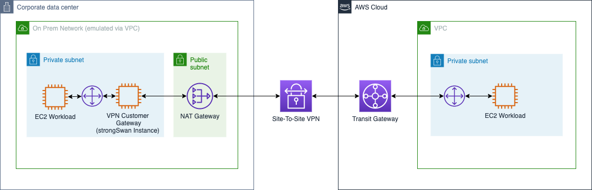

# VPN Site to Site connection via AWS Transit Gateway Lab

In this lab, you will setup a VPN site to site connection between a simulated onprem site in AWS and an AWS VPC.

We will use in this lab [AWS Transit Gateway](https://aws.amazon.com/transit-gateway/) VPN support to link a simulated on prem environment with an AWS VPC.
For the on prem VPN Gateway we will use [strongSwan VPN solution](https://www.strongswan.org/).

See the diagram below for a depiction of the complete architecture.

## Modules

This lab is split into multiple modules. Each module builds upon the previous module. You must complete each module before proceeding to the next.

1. **Environments Deployment** - In this module, you will create two symmetric AWS VPC environment. The first environment is to simulate an on prem environement with a VPN Gateway. The second environment will represent the AWS VPC to be linked to the on prem envirnment using AWS Transit Gateway. 

2. **VPN Configuration** - In this module, you will create and configure all prerequisites, including the AWS Transit Gateway, the Customer Gateway and the VPN Site-To-Site configuration.

3. **VPN Gateway Deployment** - In this module, you will deploy the VPN Gateway, configure the routes and finally test the connectivity.

## Getting Started

You may now proceed to [Module 1 - Environments Deployment](./1_EnvironmentsDeployment).
